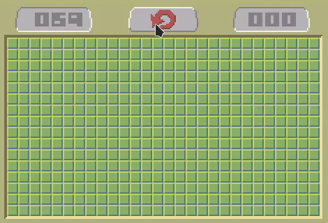

# Minesweeper

An implementation of Minesweeper using the [Phaser](https://phaser.io) game framework.

## Playing

The game requires a web server in order to run and it's configured to download the Phaser framework from the internet.

If you want to create an offline version, download the Phaser framework (v3.55.2) from [here](https://phaser.io/download/release/3.55.2) and include the .js file in the head of `index.html`. A web server will still be required to play it.
